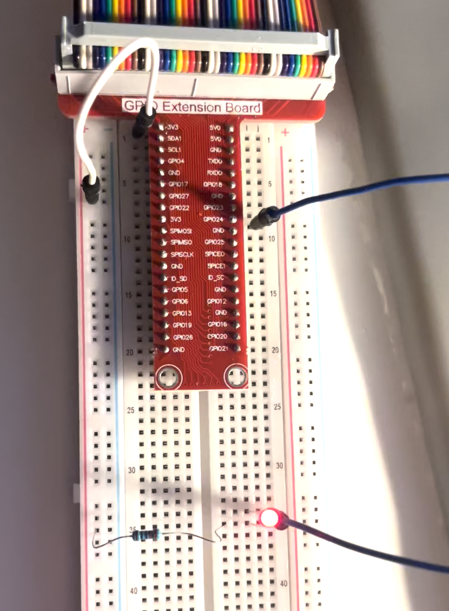
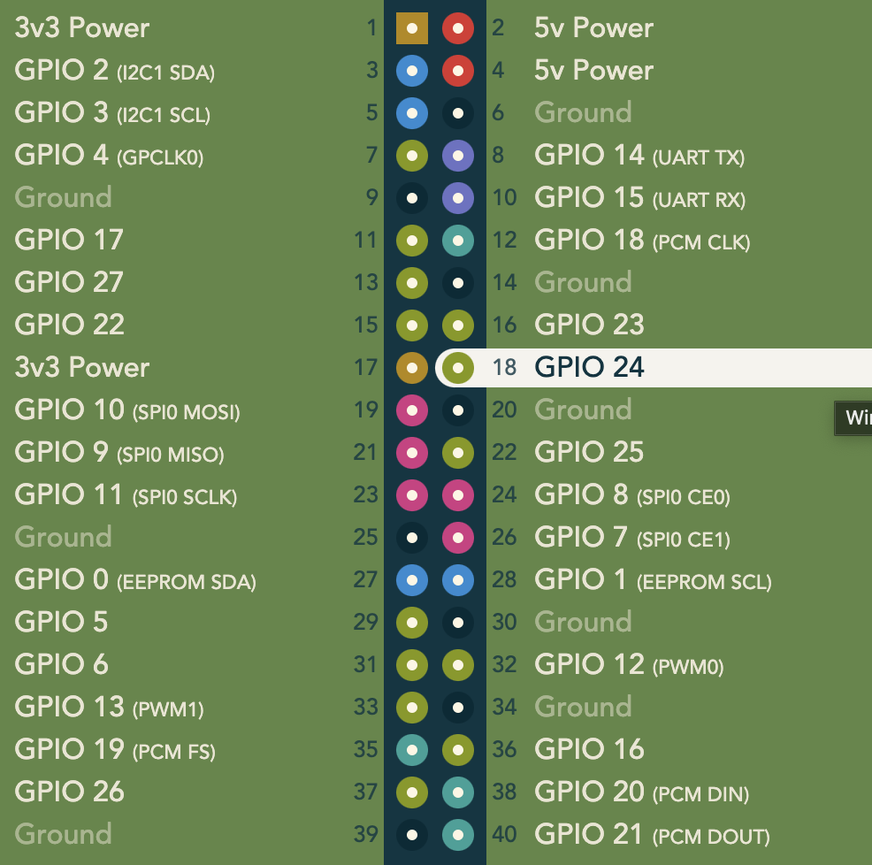

# Simple Led Blink on Raspberry Pi 3B

Demo video [here](media/demo.MOV).

**Components:**
- Raspberry Pi 3B
- 220Ohm resistor
- Led

## Lessons learnt: 
- How the extension board and its pins work. Each GPIO pin corresponds to a physical pin number on the board. See picture below ([Reference](https://pinout.xyz/)). 
- Ground pins labelled "GND" supplies constant power. That means if the blue jumper cable is moved from the pin "GPIO24" to any of the "GND" pins, the red led will light up constantly.
- Found a great [resistor colour identifier webpage](https://www.tomshardware.com/how-to/resistor-color-codes#:~:text=220%20Ohm%20Resistor%20Color%20Code&text=\(%E2%80%9CThe%20light%20that%20burns%20twice,%2DBlack%2DBlack%2DGold.) for future reference.

